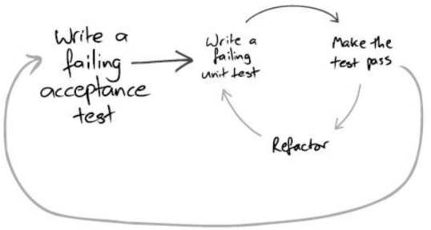

# Insight



## OutSide In 방식의 ATDD with TDD

1. 시나리오 기반으로 실패하는 인수 테스트를 작성하고
2. Outside In TDD → 실패하는 단위 테스트를 작성하고 → 에러 메시지 확인 → 테스트 케이스를 통과하도록 프로덕션 코드를 구현하고 →  리팩토링
3. 최종적으로 TDD 성공을 확인한 다음 ATDD 가 성공하면 된다.

> 인수 테스트를 작성하고나서 → 인수테스트를 동작시키기 위해 컨트롤러가 필요하므로 컨트롤러를 먼저 만들고 → 실패하는 단위 테스트를 작성한 다음 → 에러 메시지를 확인하면서 → 프로덕션 코드를 구현해나가고 → TDD 성공을 확인한 다음 → ATDD 성공을 확인한다.

### OutSide In

- 패키지와 Controller(or Service or Request, Response) 클래스만(틀만)만들어두고 테스트 코드를 작성
- 도메인에 대한 이해도가 높지 않은 상태에서 진행이 가능
- __실패한 테스트를 먼저 작성 → 에러 메시지 확인 → 그 다음 해야할 것을 확인__
- `컨트롤러 → 서비스 → 레포지토리 순`

## Inside Out 방식의 ATDD with TDD

1. 시나리오 기반으로 실패하는 인수 테스트를 작성하고
2. Inside Out TDD → 도메인 설계를 하면서 도메인의 프로덕션 코드를 만들고 → 도메인에 대한 단위 테스트를 만들고 → 서비스, 컨트롤러 순으로 그 기능을 구현
3. 최종적으로 TDD 성공을 확인한 다음 ATDD 가 성공하면 된다.

### Inside Out

- 도메인 설계가 충분히 이루어진 다음 진행 가능
- 가장 큰 장점 : 프로덕션 코드에 덜 의존적인 테스트가 작성됨
- TDD 사이클을 이어나가기가 상대적으로 어려움
- __도메인 설계를 먼저 해야함 → Line 을 만들고 → Line 에 대한 단위테스트를 만들고 → 그 기능을 구현__
- `도메인 → 서비스 → 컨트롤러 순`

## 테스트 코드 작성을 위해서, 기존에 Production Code 에서 필요 없던 생성자를 만든다 던지, 접근 제한자를 public 으로 바꿔주는 작업이 필요할까?

- 테스트 코드 작성을 위해서 Production Code 에 변경이 가해진다면, 나중에 다른 사람이 내 코드를 유지보수할 때, 테스트 코드 작성을 위해 생성한 메서드, 필드 등을 오용할 수 있다.
- `ReflectionUtils` 를 사용하여 리플렉션을 이용할 수 있다.

```java
private Station 서초역 = new Station("서초역");
ReflectionTestUtils.setField(서초역, "id", 1L);
```

## 비지니스 로직을 최대한 도메인으로 모을 수록 의존 관계의 방향이 최대한 한 방향으로 모아져서 테스트를 구현하기가 쉬워진다.

- 비지니스 로직이 도메인으로 집중이 되면, 도메인에 대한 로직 테스트가 쉬워진다.

## 인수 테스트와 단위 테스트

- __인수 테스트__
  - 뼈대를 잡는 느낌
- __단위 테스트__
  - 각 기능들을 상세하게 검증

## @SpringBootTest vs mock 테스트

- __@SpringBootTest__
  - 속도가 느림
  - 리팩토링을 목표로 테스트 하는 경우에는, 이미 작성된 코드가 있으니 실제 코드를 작성하는 방법이 더 편할 수 있다.
- __mock 테스트__
  - 속도가 빠름

> 내가 테스트 하고 있는 대상이 얼마나 많은 연관관계를 가지고 있고, 혹은 많은 Fixtures 를 가지고 있는지에 따라, mock 을 사용할지 실제 객체를 사용할지 정하는 편이 낫다고 생각.
> 
> 우선 순위를 두자면 실제 객체를 사용해서 TDD 를 하고, 실제 객체로 TDD 가 어렵다면 MOCK 을 사용하는 방식을 추천. 하지만 절대적인것은 아니다. 상황에 따라 적절하게 선택해야 한다.

## Cucumber

- resources
  - wooteco
    - prolog
      - ```java
        @api
        
        Scenario : 
         Given : 
         ...
        ```
        
## ATDD 가 주는 가장 큰 매력

- 다른 일을 하다가 다시 와도, 내가 어떤일을 하고 있었는지 알 수 있다.
- 테스트가 주는 안정감

## 피드백

- LineService 테스트가 큰 로직이 없고 출력만 한다는 것은 도메인 내부에 주요 도메인 로직이 잘 응집되어서 그런 것 같아요 :)
- 이런 경우 본인의 판단하에 서비스 클래스의 테스트는 생략하셔도 될 것 같습니다.
- 테스트 코드를 작성할 때 우선순위를 `인수 테스트 > 도메인 레이어 테스트 > 서비스 레이어 테스트` 순으로 생각하면서 작성하면 좋을 것 같아요 😃 
- 외부 라이브러리를 사용하는 경우 테스트 할 때도 구현하신대로 가짜 객체가 아닌 실제 객체를 활용하여 단위 테스트를 만들어주시는 걸 추천드려요.
  - __변경할 수 없는 코드 검증 시 실제 객체 사용__
    - 작동 원리를 깊이 이해하기 어려움
    - Mock 객체와 실제 객체의 행위를 일치시키기 어려움

## 경계값 테스트

- https://www.baeldung.com/parameterized-tests-junit-5#first-impression
