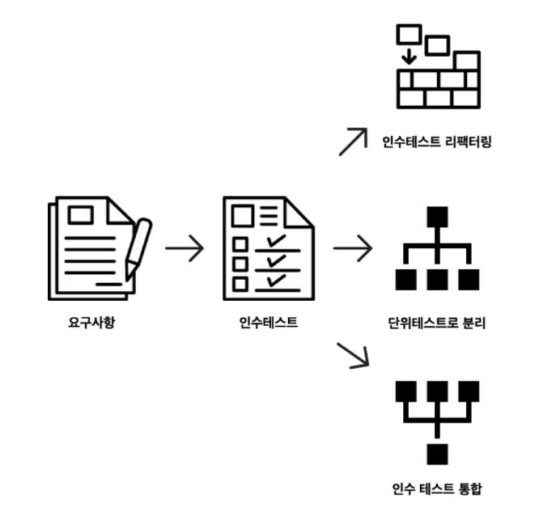

# 점진적 리팩터링 with 테스트

## 인수테스트에 대한 궁금증

- 응답 코드만으로 검증할 수 있을까?
- 실제로 데이터가 저장되었는지에 대한 검증이 필요할 수 있지 않을까?

```
Scenario: 지하철 노선을 제거한다.
  Given 지하철 노선이 등록되어 있다
  When 지하철 노선을 삭제 요청한다.
  Then 지하철 노선이 삭제된다.
```

- given: 지하철 노선 등록 request 보내기
- when: 지하철 노선 삭제 request 보내기
- then: 지하철 노선 삭제를 확인하기
  - 방법1: 지하철 노선 삭제의 응답 코드로 확인
  - 방법2: 지하철 노선 조회 request 후 response 값에서 확인

### 방법2의 경우...

- 항상 given/when/then 이후 when/then 의 스탭이 추가로 필요함
- 테스트 목적은 다르지만 같은 로직을 검증하는 인수 테스트가 발생할 수 있음

```
Scenario: 지하철 노선을 생성한다.
  When 지하철 노선을 생성 요청
  Then 지하철 노선이 생성됨
  When 지하철 노선 목록을 요청
  Then 지하철 노선 목록에서 확인됨
```
```
Scenario: 지하철 노선 목록을 조회한다.
  Given 지하철 노선을 생성 되어있음
  When 지하철 노선 목록을 요청
  Then 지하철 노선 목록에서 확인됨
```

- 지하철 노선을 생성 되어있음 에서 정상 동작을 확인하지 않으면 의도하지 않은 경우가 발생

### 인수 테스트 리팩터링



## 인수 테스트 통합

```
Feature: 즐겨찾기를 관리한다.

  Background 
    Given 지하철역 등록되어 있음
    And 지하철 노선 등록되어 있음
    And 지하철 노선에 지하철역 등록되어 있음
    And 회원 등록되어 있음
    And 로그인 되어있음

  Scenario: 즐겨찾기를 관리
    When 즐겨찾기 생성을 요청
    Then 즐겨찾기 생성됨
    When 즐겨찾기 목록 조회 요청
    Then 즐겨찾기 목록 조회됨
    When 즐겨찾기 삭제 요청
    Then 즐겨찾기 삭제됨
```

### 인수 테스트 통합 시 우려되는 점

- 하나의 테스트가 많은 것을 검증하는게 아닌가?
- 테스트를 작성하기 어려워진거 아닌가?

### 인수 테스트의 검증 대상

- `사용자 관점의 기능과 플로우`

### 인수 테스트 통합 시 장점

- 테스트 비용 절감
- 인수 테스트 스텝의 중복을 효과적으로 제거할 수 있음
- 흐름을 검증하면서 자연스럽게 사용자 스토리에 대한 검증이 가능
- 자연스럽게 기능의 메인 흐름에 대해 검증
- 사이드 케이스는 단위 테스트에서 수행하게 유도

### 통합 인수 테스트 작성 방법

- 기존 처럼 따로 만든 다음 하나로 통합하기
- 처음부터 하나의 테스트 메서드로 한 스텝씩 검증하면서 구현하기

## 레거시 리팩터링

신규 개발이 아닌 `기존 코드(레거시)` 에서 구조 개선 및 리팩터링을 할 경우

- __인수 테스트가 있었다면__
  - 기능 변경 혹은 리팩터링을 하더라도 마음껏 할 수 있음
  - 작업하다가 막히거나 꼬이(?)더라도 인수 테스트가 성공하는 시점으로 돌아갈 수 있음
- __인수 테스트가 없다면__
  - 인수 테스트를 먼저 만들고 시작하자
  - 세부 구현에 의존하지 않는 블랙 박스 테스트기 때문에 구현이 변경되더라도 검증 가능
- __인수 테스트 다음 스텝__
  - 인수 테스트를 성공 시키기 위한 단위 테스트 작성
  - 단위 테스트를 성공 시키기 위한 기능 구현
  - 단위 테스트 성공 후 리팩터링
  - 그리고 반복

### 기존 코드를 바로 수정하면?

- 변경한 부분을 의존하는 부분에서 빨간불 🔥
- 기존 테스트 코드 모두 실패 🔴

### 기존 테스트 코드를 바로 수정하면?

- 코드를 바로 수정하는 것 보다는 나음
- 하지만 테스트 코드를 수정하므로서 해당 테스트가 검증하고 있던 프로덕션 코드를 검증할 수 없게됨

## 테스트, TDD는 비효율적인가?

- TDD 나 테스트 작성을 꺼려하는 사람들의 가장 큰 이유가 이것
- 테스트를 작성해도 기능이 변경되면 수정해야할 것이 2배가 되어 번거롭다고 느낌
- 이렇게 생각하는 이유는 바로 프로덕션 코드나 테스트 코드를 변경하기 때문

## 레거시 리팩터링 단계

- Ex. 인증 방법 추가하기
  - 기존에 세션 기반 인증에서 토큰 기반 인증 방법 추가

### 1. 구조 설계하기

- 요구사항에 맞춰 구조를 설계
- 확장성을 고려하여 구조를 설계한다.

### 2. 새로운 단위 테스트 만들기

- `반드시 기존 테스트와 프로덕션 코드는 그대로 두기`

### 3. 기능 구현하기

- 기존 코드와 중복이 발생 할 수 있음
- 기존 코드와 신규 코드가 함께 존재함
- 작업 중 다른 작업을 하더라도 문제가 없음
- 기존 코드가 유지되어 기능에 이슈는 없고, 신규 작업한 코드도 그대로 남아있음
  - 단, 기존 코드와 신규 코드가 혼재되는 기간을 짧게 가져가도록 해야함

### 4. 테스트 성공 후 리팩터링

- 리팩터링은 테스트 코드가 검증할 수 있는 범위 내에서 시도

### 5. 2 ~ 4 반복

- 기존 코드를 대체할 수 있을 때 대체
- 기존 프로덕션 코드와 테스트 코드 제거
