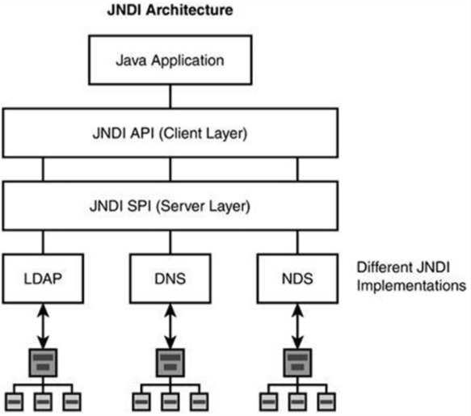
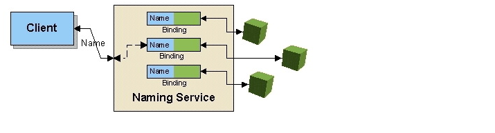

# JDBC 란 

JDBC(Java Database Connectivity) 는 관계형 데이터베이스에 액세스하기위한 Java API 이다.

# HikariCP

HikariCP 는 Brett Wooldridge 가 2012 년에 개발한 `매우 가볍고 빠르고 안정적인` JDBC Connection Pool 이다.

> HikariCP 는 `zero-overhead` 라고 홍보하고 있다.

HikariCP 는 `Database Connection Pool` 을 관리하는 역할을 한다. connection pool 을 관리하는 것이 중요한 이유는 성능에 큰 영향을 미치기 때문이다. 커넥션을 맺는 과정이 복잡하고 컴퓨터 자원을 많이 소모하는 작업이다.

> connection pool : DB 에 대한 향후 연결이 필요한 경우, 연결을 재사용할 수 있도록 하는 DB 연결의 캐시이다. 커넥션 풀은 전체 리소스 사용량을 크게 줄일 수 있다.

HikariCP 는 미리 정해 놓은 만큼의 connection 을 pool 에 담아 놓고 요청이 들어오면 Thread 가 connection 을 요청하고 HikariCP 는 Pool 내에 있는 connection 을 연결해 준다.

기존에 SpringBoot에선 tomcat-jdbc 를 기본 Datasource 로 제공햇었는데 2.0 부터는 HikariCP 를 기본으로 사용한다.

# JNDI(Java Naming and Directory Interface)

엔터프라이즈 애플리케이션을 위한 네이밍과 디렉토리 서비스 표준 인터페이스이다

- Learn the concepts of naming services(네이밍 서비스의 개념)
  - 여러 분산 시스템들이 있다고 하자. Naming은 이런 분산 시스템들의 서비스들 중에 하나 이다.그리고 바인딩이라는것이 있는데 예를 들면 acet.pe.kr 는 ip address100.200.300.400 이였던 것이다.
소위 DNS(Domain Naming Service)을 생각하면 더 빠르게 이해가 될 듯 싶다. 즉, 핵심은 `Naming - Binding 의 형태로 서비스`를 하는 것이다.

- Learn the concepts of directory services(디렉토리 서비스의 개념)
  - 디렉토리 서비스는 빠른조회, 드문 삽입, 삭제, 수정에 대한 저장오브젝트들인 특별한 타입의 데이터베이스라고 볼 수 있다. LDAP 이 가장 인기있는 directory protocol 이다. 표준 네트워크 디렉토리 서비스 이다.

- Explore the JNDI architecture(JNDI의 아키텍처)
  - JNDI is a unified Java API designed to standardized access to a variety of `naming and directory services`
  - 2가지로 구분된다 : API, SPI

- An application-level programming interface (API). APIs are used by the application components to access naming and directory services.
  - 우리가 잘 알고 있는 API 형태

- A service provider interface (SPI). This part of the API is used to plug in a provider of a naming and directory service to the J2EE platform.
  - API 의 부분으로써 J2EE 플랫폼 기반에 네이밍과 디렉토리 서비스의 제공자를 연결시킨다. 즉 SPI 가 LDAP, DNS, NDS 등 서비스 제공자들을 연결 시킨다.

> JNDI is a fundamental service to all J2EE applications

Naming 서비스는 Java Naming and Directory Interface(JNDI) API를 이용하여 자원(Resource)를 찾을 수 있도록 도와주는 서비스이다.

Naming 서비스를 지원하는 Naming 서버에 자원을 등록하여 다른 어플리케이션에서 사용할 수 있도록 공개하고, Naming 서버에 등록되어 있는 자원을 찾아와서 이용할 수 있게 한다.

## 참고 

> [jojoldo. SpringBoot 와 HikariCP](https://jojoldu.tistory.com/296)
> 
> https://yjh5369.tistory.com/478
> 
> [HikariCP 에 대한 성능](https://www.wix.engineering/post/how-does-hikaricp-compare-to-other-connection-pools)
> 
> [Spring Boot 1.5.4-release 에서 HikariCP 설정하기](https://yeti.tistory.com/120)
> 
> https://acet.pe.kr/214
