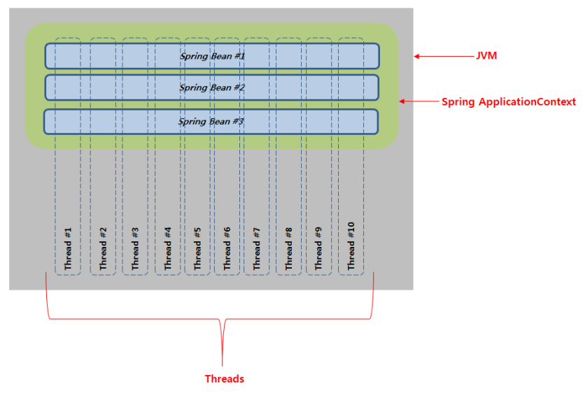

# 멀티 스레드

멀티 스레드로 인한 객체 공유 문제를 해결하기 위해서, 전역변수 or 멤버변수를 사용하지 않는것이 좋다. 이 문제를 해결하기위해서는 `지역변수`를 사용하는 방법이 있다.

스프링에서 `멤버변수`는 Injection 에 사용하는 bean 일 경우만 사용하도록 권고 한다.

## References

- [멀티 스레드 환경에서 스프링 빈 주의 사항](https://beyondj2ee.wordpress.com/2013/02/28/%EB%A9%80%ED%8B%B0-%EC%93%B0%EB%A0%88%EB%93%9C-%ED%99%98%EA%B2%BD%EC%97%90%EC%84%9C-%EC%8A%A4%ED%94%84%EB%A7%81%EB%B9%88-%EC%A3%BC%EC%9D%98%EC%82%AC%ED%95%AD/)
- [Java 에서 스레드 안전이란 ?](https://stackoverflow.com/questions/6324085/what-is-thread-safe-in-java)

